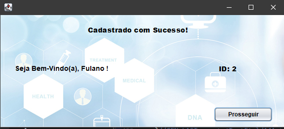
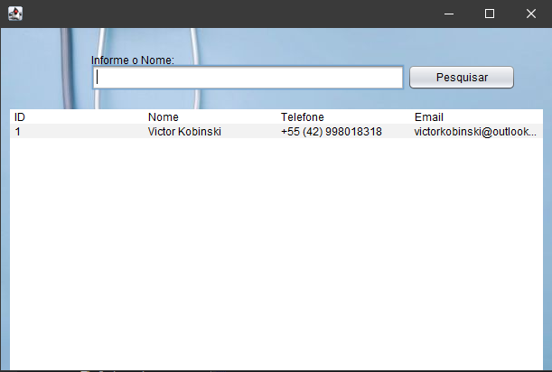
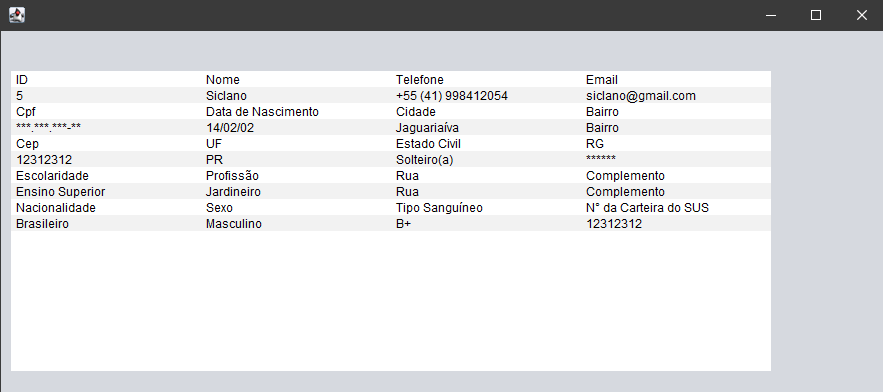

<h1> Sistema de Consultório </h1>
&nbsp;&nbsp;&nbsp;&nbsp;

  Projeto feito em Java que simula um sistema de cadastro de novos pacientes.  
  Utiliza as tecnologias:
  <ul>
  <li>☕ Java.</li>
  <li>🐬 MySQL.</li>
  </ul>
  
  <h1> Sobre o funcionamento </h1>
  &nbsp;&nbsp;&nbsp;&nbsp;
   
 O programa possui um sistema de Login, que faz a checagem do Usuário e Senha da pessoa.  
     
    
    

   
 Se o paciente já tiver cadastro, poderá fazer seu login normalmente, se não o tiver, poderá se cadastrar, abrindo a interface.  
     
    
    

    
 Se os dados estiverem todos preenchidos, o usuário será criado, mandado para a base de dados.  
     
    
    

    
 Após isso, poderá ser feito o Login, com o usuário criado.  
     
    
    

    
 A tela de Pesquisa já mostra uma tabela com os usuários já cadastrados, mas, pode ser usada para pesquisar um em específico.  
     
    
    

    
 Mostrando assim, seus dados.  
     
    
    

    
    
    
    
   
   
  
  
